<div align="center">
  <h1>Runner Pulse - Advanced Running Analytics App</h1>

Project Link: [https://runner-pulse.vercel.app/](https://runner-pulse.vercel.app/)

Runner Pulse is a comprehensive web application designed for passionate runners to track, analyze, and improve their performance. Built with modern web technologies, this app offers a sleek, responsive interface and powerful analytics tools.

<h4>
    <a href="https://runner-pulse.vercel.app/">Live</a>
  <span> · </span>
    <a href="https://66e7fab26977c0410ed6ca2b-ymdpnwigph.chromatic.com">Storybook</a>
  <span> · </span>
    <a href="https://github.com/philipstubbs13/runner-pulse/issues">Report Issue</a>
  </h4>
  
</div>

<br />

# Table of Contents

- [Screenshots](#screenshots)
- [Acknowledgments](#about-the-project)
- [About the Project](#about-the-project)
  - [Built With](#tech-stack)
  - [Key Features](#features)
  - [Technical Highlights](#highlights)
  - [My Expertise](#expertise)
- [Getting Started](#getting-started)
- [Prisma ORM](#prisma)
- [Running Storybook](#running-storybook)
- [Running Tests](#running-tests)
- [Deployment](#deployment)
- [Contributing](#contributing)
- [Contact](#contact)
- [Issues And Requests](#issues-and-requests)

## <a name="screenshots"></a> Screenshots

### Charts

#### Race Distribution By City Chart

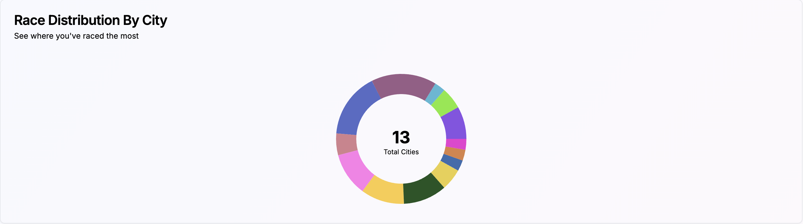

#### Performance Over Time Chart

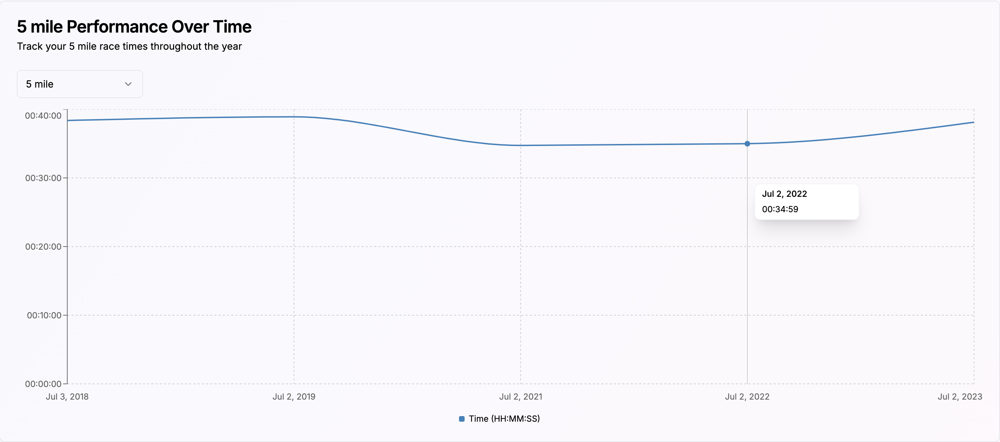

#### Average Time By Distance Chart

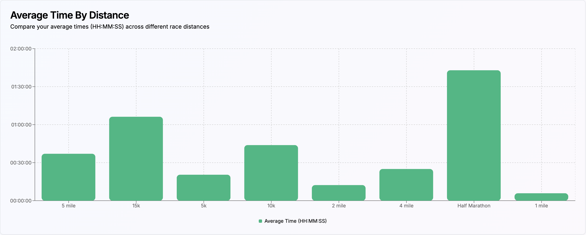

### Login

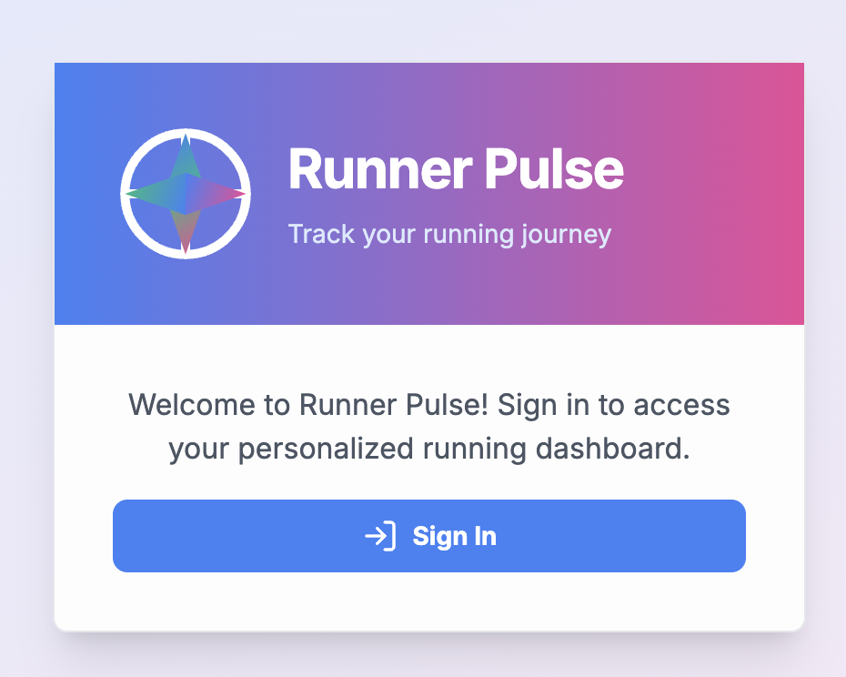

### Personal Results

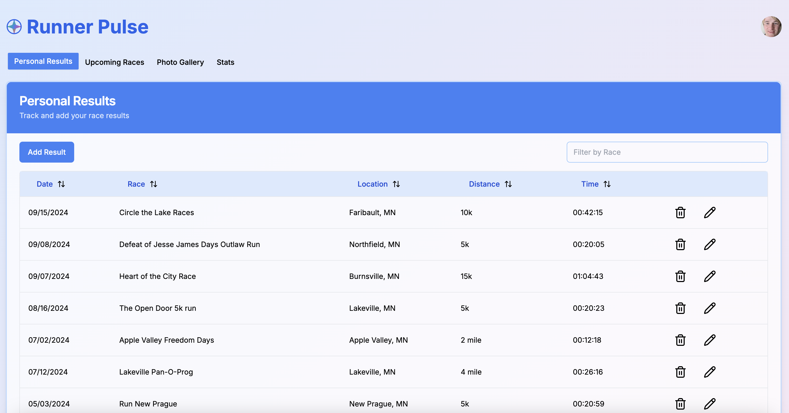

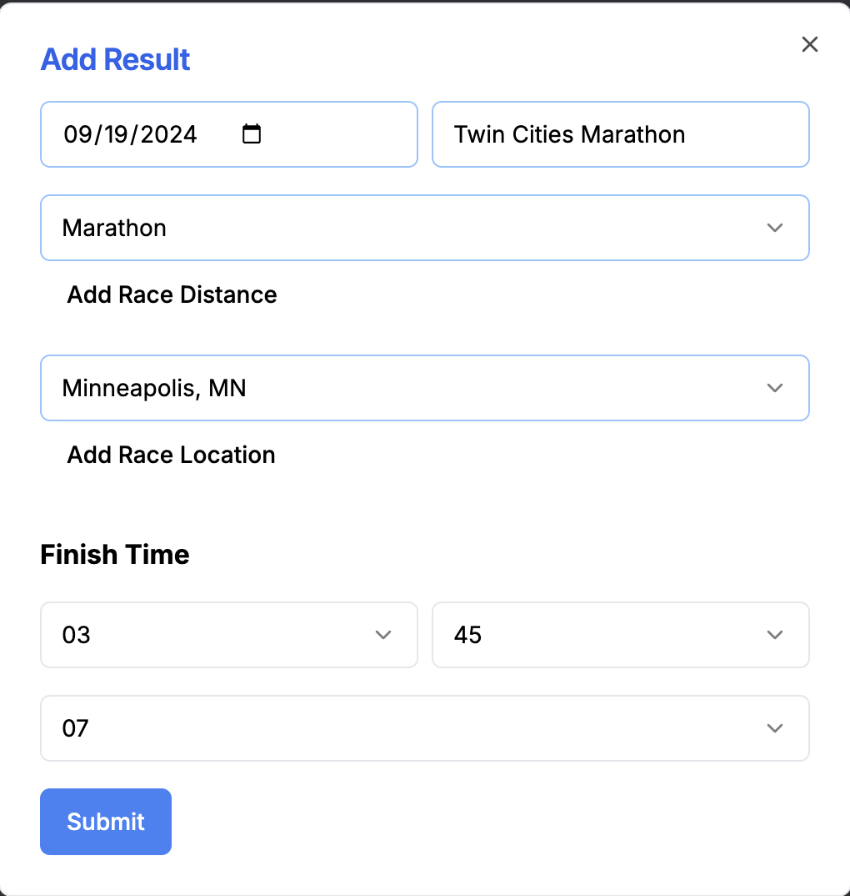

### Upcoming Races

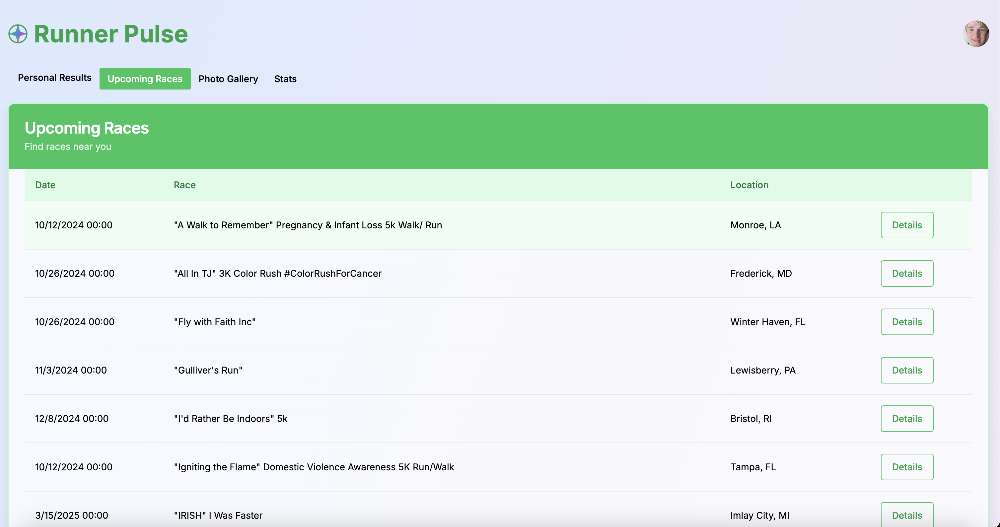

### Race Details

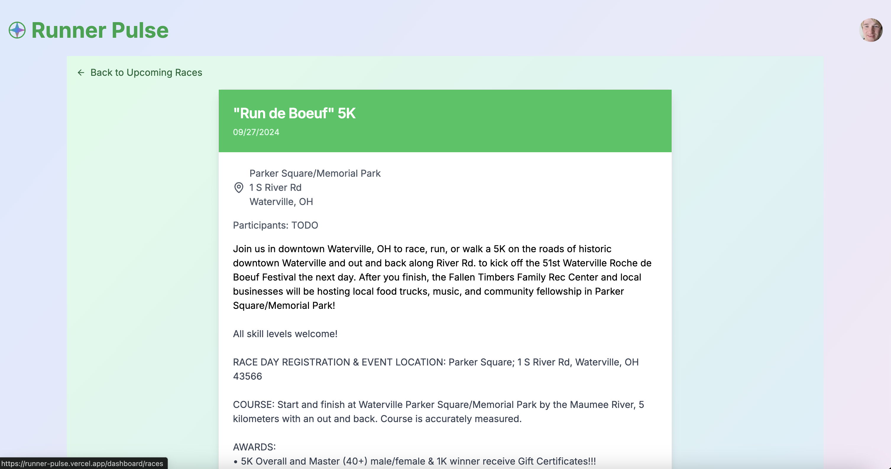

### Photo Gallery


### Stats

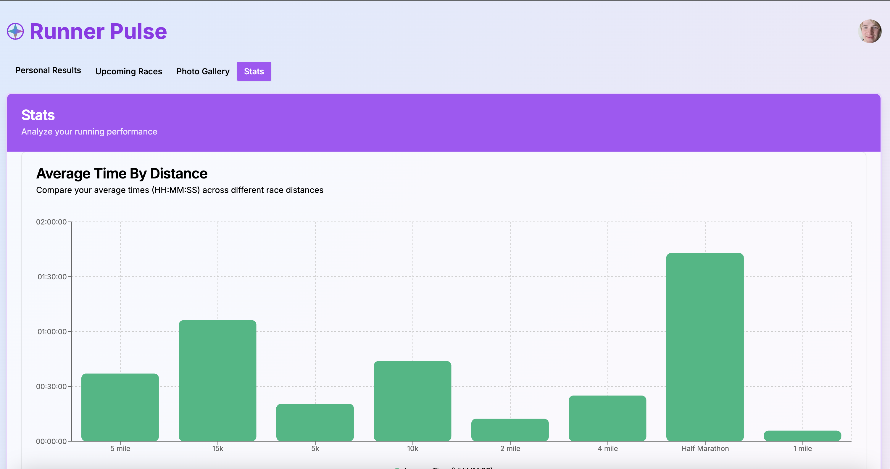

### Manage Race Distances

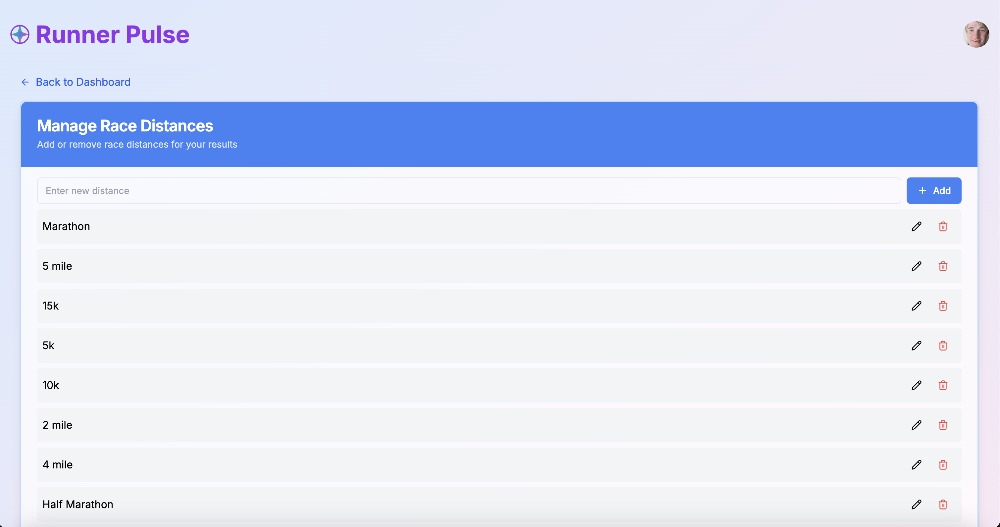

### Manage Race Locations

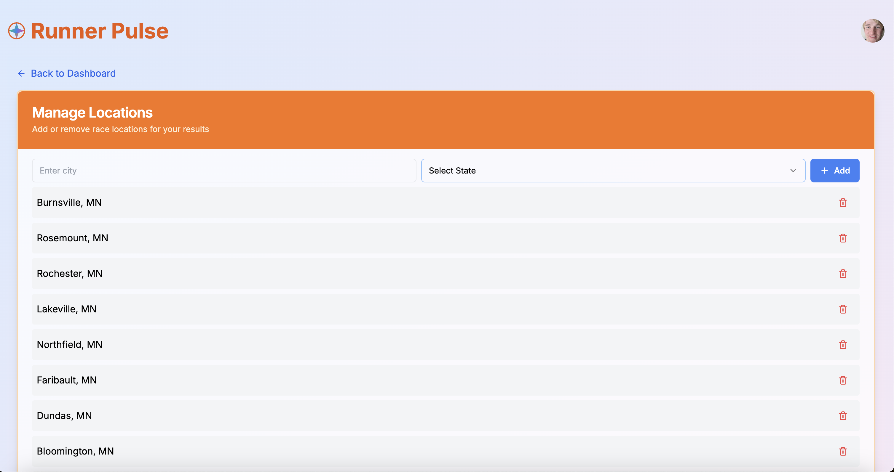

## <a name="acknowledgments"></a>Acknowledgments

- [Storybook](https://storybook.js.org/) for simplifying UI development, testing, and documentation.
- [Next.js](https://nextjs.org/) for the robust and flexible React framework.

## <a name="about-the-project"></a>About the Project

This project showcases the ability to deliver a feature-rich, user-centric application that caters to the specific needs of the running community while leveraging cutting-edge web development technologies.

### <a name="tech-stack"></a>Built With

  <ul>
      <li><a href="https://runsignup.com/API"">RunSignup API</a></li>
    <li><a href="https://www.typescriptlang.org/">Typescript</a></li>
    <li><a href="https://react.dev/">React.js</a></li>
    <li><a href="https://nextjs.org/">Next.js</a></li>
    <li><a href="https://tailwindcss.com/">Tailwind</a></li>
    <li><a href="https://66e7fab26977c0410ed6ca2b-ymdpnwigph.chromatic.com">Storybook</a></li>
    <li><a href="https://www.chromatic.com/library?appId=66e7fab26977c0410ed6ca2b">Chromatic</a></li>
    <li><a href="https://recharts.org/en-US/">Recharts</a></li>
    <li><a href="https://www.mongodb.com/">MongoDB</a></li>
    <li><a href="https://www.prisma.io/">Prisma</a></li>
    <li><a href="https://cloudinary.com/">Cloudinary</a></li>
    <li><a href="https://ui.shadcn.com/">shadcn/ui</a></li>
    <li><a href="https://next-auth.js.org/">NextAuth</a></li>
    <li><a href="https://vitest.dev/">Vitest (unit testing framework)</a></li>
    <li><a href="https://tanstack.com/table/v8">TanStack Table</a></li>
  </ul>

### <a name="features"></a>Key Features

- Personal race result tracking and anaylsis
- Interactive performance charts and statistics
- Upcoming race discovery and management
- Photo gallery for capturing running memories
- Customizable user profiles and settings

### <a name="highlights"></a> Technical Highlights

- Developed using React and Next.js for a fast, server-side rendered experience.
- Responsive design implemented with Tailwind CSS for a seamless mobile and desktop experience.
- Interactive charts created using Recharts library for data visualization.
- State management and routing handled efficiently with React hooks and Next.js App Router.
- Accessible UI components built with shadcn/ui library.
- Module architecture for easy maintenance and scalability.

### <a name="expertise"></a> My Expertise

The Runner Pulse app demonstrates expertise in:

- Building complex, data-driven React applications.
- Creating intuitive and responsive user interfaces.
- Implementing advanced data visualization techniques.
- Developing performant and scalable web applications.

## <a name="getting-started"></a>Getting Started

Follow these instructions to set up and run the project on your local machine.

1. Clone the project from GitHub.

```bash
  git clone https://github.com/philipstubbs13/runner-pulse.git
```

2. Go to the project directory.

```bash
  cd runner-pulse
```

3. Install dependencies.

```bash
  npm install
```

4. Set up environment variables.

   a. In the root of the project, create a `.env` file.

   b. Copy the environment variables from `.env.example` into the `.env` file.

5. Start the Next.js development server.

```bash
  npm run dev
```

Open [http://localhost:3000](http://localhost:3000) with your browser to see the result.

You can start editing the page by modifying `app/page.tsx`. The page auto-updates as you edit the file.

This project uses [`next/font`](https://nextjs.org/docs/basic-features/font-optimization) to automatically optimize and load Inter, a custom Google Font.

To learn more about Next.js, take a look at the following resources:

- [Next.js Documentation](https://nextjs.org/docs) - learn about Next.js features and API.
- [Learn Next.js](https://nextjs.org/learn) - an interactive Next.js tutorial.

## <a name="prisma"></a>Prisma ORM

This project uses [Prisma](https://www.prisma.io/docs/getting-started), which is a Node.js and TypeScript ORM (Object Relational Mapper) used to model data, run schema migrations, and query the database (MongoDB).

### Making Schema Changes

The Prisma schema file for this project is located at `prisma/schema.prisma`.

If you need to make changes to the database schema:

1. Update `prisma/schema.prisma` with your changes.

2. In the root directory of the project, run `npx prisma db format` to validate, format, and persist the schema

3. In the root directory of the project, run `npx prisma db push` to push the state of your Prisma schema to the database without using migrations.

4. In the root directory of the project, run `npm run ts` to verify that there are no typescript errors for the project.

### Benefits of Using Prisma:

- **Type-Safety**.
  Prisma generates fully type-safe queries for TypeScript, ensuring that database queries are validated at compile time. This reduces runtime errors and improves developer productivity by leveraging IDE autocompletion and error checking.

- **Readable and Maintainable Queries**.
  Prisma provides a high-level, readable API for database operations, making it easier to write and understand complex queries without diving into specific database syntax. This results in cleaner, more maintainable code.

- **Database Agnostic**.
  Prisma supports multipledatabases like PostgreSQL, MySQL, SQLite, SQL Server, and MongoDB. This flexibility allows you to switch databases with minimal configuration changes. For this project, the database is MongoDB.

- **Automatic Migrations**.
  Prisma automatically generates migration files based on changes to your data models, making schema changes easier to track and manage across environments. You can apply and revert migrations safely, ensuring consistency in your database structure.

- **Efficient Querying**.
  Prisma optimizes query performance by reducing the number of round-trips to the database and providing smart query batching techniques, improving overall application performance.

- **Modern Tooling & Ecosystem**.
  Prisma integrates seamlessly with modern technologies like GraphQL, REST, and serverless architectures, offering a powerful toolset for full-stack applications.

- **Collaborative with TypeScript**.
  While working in a TypeScript codebase, Prisma enhances collaboration between front-end and back-end by creating shared types and making the database layer more predictable and consistent.

- **Comprehensive Documentation & Community**.
  Prisma comes with extensive documentation, tutorials, and a growing community, making it easier for teams to get up to speed and troubleshoot issues.

## <a name="running-storybook"></a>Running Storybook

This project uses [Storybook](https://storybook.js.org/). Storybook is a frontend development tool for developing, testing, and documenting UI components in complete isolation from the applications in which they are used. In this Storybook, you will find all of the UI components used throughout the app and documentation on how to use/implement these components.

To run Storybook for this project, run the following command in the root directory of this project.

```bash
  npm run storybook
```

The Storybook for this project is deployed to the following URL: <https://66e7fab26977c0410ed6ca2b-ymdpnwigph.chromatic.com>

## Chromatic

For this project, Storybook is deployed via Chromatic. Chromatic catalogs the component library across commits and branches. If you plan to contribute to this project, it can help with reviewing the UI components, see past versions of the component, and get feedback on any work in progress.

The Chromatic library is available at the following URL (mostly valuable only if you plan to contribute to this project):

<https://www.chromatic.com/library?appId=66e7fab26977c0410ed6ca2b>

Currently, When you push code to the main branch, a GitHub action is set up for this repository to automatically kick off a build in Chromatic. The Chromatic GitHub action is located in the **.github/workflows** directory of the repository. The `CHROMATIC_PROJECT_TOKEN` must be configured as a repository secret in the settings of this repository for this action to work.

When this action is run, a build will be kicked off. After the build is complete, you can review the component changes associated with that build and either accept or deny those changes from the Chromatic library.

## <a name="running-tests"></a>Running Tests

This project uses [vitest](https://vitest.dev/) for unit tests. To run the unit tests for this project, run the following command in the root directory of this project.

```bash
  npm run test
```

To generate a test coverage report, run the following command:

```bash
npm run coverage
```

### <a name="deployment"></a>Deployment

This app is deployed through the [Vercel Platform](https://vercel.com/new?utm_medium=default-template&filter=next.js&utm_source=create-next-app&utm_campaign=create-next-app-readme).
Deploys are set up to happen automatically when code is merged into the `main` branch.

## <a name="contributing"></a>Contributing

Contributions are welcome! Please open an issue or submit a pull request for any improvements or bug fixes.

## <a name="contact"></a>Contact

Phil Stubbs - philipstubbs13@gmail.com

## <a name="issues-and-requests"></a>Issues and Requests

If you find an issue while using the application or have a request, log the issue or request [here](https://github.com/philipstubbs13/runner-pulse/issues). These will be addressed in a future code update.
